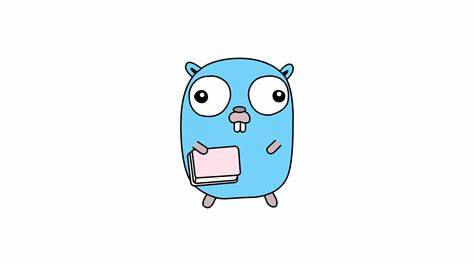
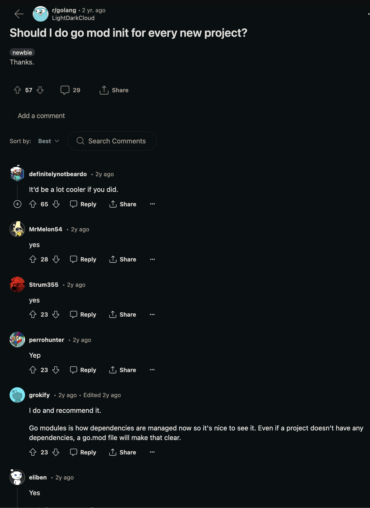

# Terratest Lunch N' Learn

## Pre-requisites

- Install Terraform: https://developer.hashicorp.com/terraform/tutorials/aws-get-started/install-cli
- Install Golang: https://go.dev/doc/install


## History of Go

Go attempts to combine the ease of programming of an interpreted, dynamically typed 
language with the efficiency and safety of a statically typed, compiled language. 
It also aimed to be better adapted to current hardware, with support for networked 
and multicore computing. Finally, working with Go is intended to be fast: it should 
take at most a few seconds to build a large executable on a single computer.



## Golang Introduction

Basic program in Go: [source](https://www.digitalocean.com/community/tutorials/how-to-write-your-first-program-in-go)
```Golang
package main

import "fmt"

func main() {
    var name string
    fmt.Println("What's your name?")
    fmt.Scanln(&name)
    fmt.Printf("Hi, %s! I'm Go!", name)
}
```
Output:
```
~/software/lunch-n-learn-terratest main % go run example.go
What's your name?
Garrett
Hi, Garrett! I'm Go!
```
Let's analyze the components: 

- `package`: a named collection of one or more related `.go` files.
    - Helps you isolate and reuse code.
    - Every .go file that you write should begin with a package
    - Can only have **1** package per directory.
- We are importing `fmt`, a package in the Go standard library
    - > Package fmt implements formatted I/O with functions analogous to C's 
    printf and scanf. The format 'verbs' are derived from C's but are simpler.
    - Library docs: https://pkg.go.dev/fmt
- `&` the *ampersand* Gets/returns the memory address of a variable
    - In this instance, we reference the memory address of `name`
    which is an integer.
    - **Why use a  pointer?** `Scanln()` requires a memory address
    to write the user input to.
        - see more here: https://pkg.go.dev/fmt#Scanln
- The rest is simple.

## Building and running Go

Go is a [compiled language](https://en.wikipedia.org/wiki/Compiled_language) like C/C++/Java, etc.

In short, compiled languages are compiled before runtime and output an [executable file](https://www.techtarget.com/whatis/definition/executable-file-exe-file) where the program is translated into bytecode for the computer to interpret/execute.

This translation is also done with interpreted languages like Python but its just done at runtime, which is one of the main reasons these languages are so much slower.

### go build

We can compile our Go code with `go build my_file.go` which will produce an executable file with the same name of the file.

#### Example
```
~/example  % ll
total 8
drwxr-xr-x    3 a206726493  staff    96B May  7 12:59 ./
drwxr-x---+ 115 a206726493  staff   3.6K May  7 12:59 ../
-rw-r--r--    1 a206726493  staff    74B May  7 12:59 main.go
~/example  % go build main.go
~/example  % ll
total 3808
drwxr-xr-x    4 a206726493  staff   128B May  7 12:59 ./
drwxr-x---+ 115 a206726493  staff   3.6K May  7 12:59 ../
-rwxr-xr-x    1 a206726493  staff   1.9M May  7 12:59 main*
-rw-r--r--    1 a206726493  staff    74B May  7 12:59 main.go
~/example  % ./main
Hello, World
~/example  %
```

### go run

We can also run our go code directly with `go run my_file.go`. 

In this instance, the Go code is still compiled as an executable but the command also runs the executable and immediately discards the executable file.

#### Example
```
~/example  % ll
total 8
drwxr-xr-x    3 a206726493  staff    96B May  7 13:01 ./
drwxr-x---+ 115 a206726493  staff   3.6K May  7 13:01 ../
-rw-r--r--    1 a206726493  staff    74B May  7 12:59 main.go
~/example  % go run main.go
Hello, World
~/example  % ll
total 8
drwxr-xr-x    3 a206726493  staff    96B May  7 13:01 ./
drwxr-x---+ 115 a206726493  staff   3.6K May  7 13:01 ../
-rw-r--r--    1 a206726493  staff    74B May  7 12:59 main.go
~/example  %
```

## Exercise 1: Build and run Go code 

1. Write your own simple Go file or use this template file: \
github.com/garrettohara/lunch-n-learn-terratest/blob/main/exercise_1.go

2. Run the code: \
    You can compile with 
    ```
    go build <YOUR_FILE
    ``` 
    and then execute with 
    ```
    ./<YOUR_FILE>
    ```
    Or just run with 
    ```
    go run <YOUR_FILE>
    ```
<br />
3. Please clap...


## go mod init

A Go module is a collection of Go packages stored in a file tree with a `go.mod` file at its root.

The command `go mod init <module_name>` creates a Go Module within the current directory. This essentially just creates a `go.mod` file. Which is an important component for each module.

> A common way of organising projects includes a cmd folder, where you can have cmd/server, cmd/migration, cmd/use_case
This allows the project to contain various binaries/executables in an organized manner.
source: https://stackoverflow.com/questions/32028287/cmd-folder-for-organizing-project-files-in-go

#### Example
```
my_project/
|--go.mod
|--main.go
|--cmd/
    |--server/
    |   |--go.mod
    |   |--main.go
    |--client/
        |--go.mod
        |--main.go
```

The root `go.mod` file manages certain dependencies used throughout the whole project. Whereas the sub `go.mod` files in each `server` and `client` dirs have an additional but distinct dependency layer on top of the root.

### go.mod

The `go.mod` file is pretty nifty and does some important things that makes managing a Go Module seamless.

- Remote hosting modules
- Dependency version control


If the name passed is a unique URL and hosted in a publicly accessible repository, then the package can be pulled remotely.

#### Example

Suppose I have my own Go package hosted on my personal github: github.com/garrettohara/web-server, I can generate the module via: 
```bash
path/to/web-server $ go mod init github.com/garrettohara/web-server
path/to/web-server $ git add .
path/to/web-server $ git commit -m "Initial commit"
path/to/web-server $ git push origin main
```
And I can use this module anywhere by simply calling: 
```Golang
package main

import (
    "fmt"
    "github.com/garrettohara/web-server"
)

func main() {
    var name string
    fmt.Println("What's your name?")
    fmt.Scanln(&name)
    fmt.Printf("Hi, %s! I'm Go!", name)
}
```
### Should i always `go mod init`?

The common consensus on this question is: **yes**.

There are no drawbacks when creating a Golang Module and it allows you to easily manage all the dependencies within your project. Along with other benefits.




